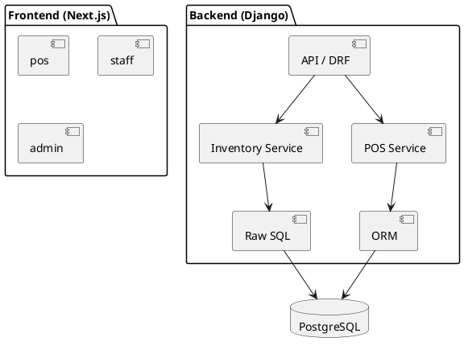

# Architecture Decision Document (Compressed)

**Project:** convenient-store | **Author:** Shaun | **Date:** 2026-01-26

---

## Technical Stack
| Layer | Technology |
|-------|------------|
| **Frontend** | Next.js 14+ (App Router), TypeScript, Tailwind + shadcn/ui |
| **Backend** | Django 5+ & Django REST Framework (DRF) |
| **Database** | PostgreSQL 15+ (Docker Compose) |
| **API Client** | Orval (OpenAPI 3.0 -> TanStack Query) |
| **State** | Zustand (Client) + TanStack Query (Server) |

---

## Project Structure
```
convenient-store/
├── frontend/ (Next.js)
│   ├── src/app/ (Route Groups: (pos), (staff), (admin))
│   ├── src/stores/ (Zustand: auth, cart, ui)
│   └── src/lib/api/ (Orval generated)
├── backend/ (Django)
│   ├── config/ (Settings)
│   ├── inventory/ (CORE: Backflush, FIFO, Raw SQL)
│   ├── pos/ (Checkout, Combos)
│   ├── catalog/ (Recipes, SKUs)
│   └── alerts/ (Polling)
└── docs/
```

---

## Data Architecture: Hybrid Pattern
- **Django ORM:** Used for 80% CRUD (Items, Staff, basic lookups).
- **Raw SQL (`queries.py`):** Mandatory for:
  - FIFO deduction (requires `FOR UPDATE` locking).
  - Backflushing (multi-table transactions).
  - Variance reports (CTEs, Window functions).

---

## Authentication & Security
- **Auth:** Stateless JWT via PIN login.
- **Fast-Switch:** New PIN overwrites session immediately.
- **Auto-Lock:** Frontend-enforced 2-min idle timer + short-lived JWT.
- **Audit:** Append-only tables; every action tagged with `staff_id` + `timestamp`.

---

## Naming Conventions (Strict)
| Element | Pattern | Example |
|---------|---------|---------|
| **DB Tables** | `snake_case` plural | `order_items` |
| **API Fields** | `snake_case` | `unit_price` |
| **Frontend Files** | `kebab-case.tsx` | `cart-item.tsx` |
| **Frontend Code** | `camelCase` | `getCartTotal` |
| **Backend Code** | `snake_case` | `is_expired` |
| **Money** | Integer (đồng) | `25000` |

---

## Subsystem Design (7 Domain Subsystems)
| Subsystem | Backend App | Responsibilities |
|-----------|-------------|------------------|
| **Auth** | `auth/` | Identity & Permissions |
| **Shift** | `shifts/` | Operations & Cash Management |
| **Catalog** | `catalog/` | Master Data (SKUs, Recipes) |
| **Inventory** | `inventory/` | FIFO, Backflush, Conversions (CORE) |
| **POS** | `pos/` | Sales & Checkout |
| **Alert** | `alerts/` | Expiry/Refill notifications |
| **Report** | `reports/` | Analytics & Drill-down |

---

## System Boundaries

