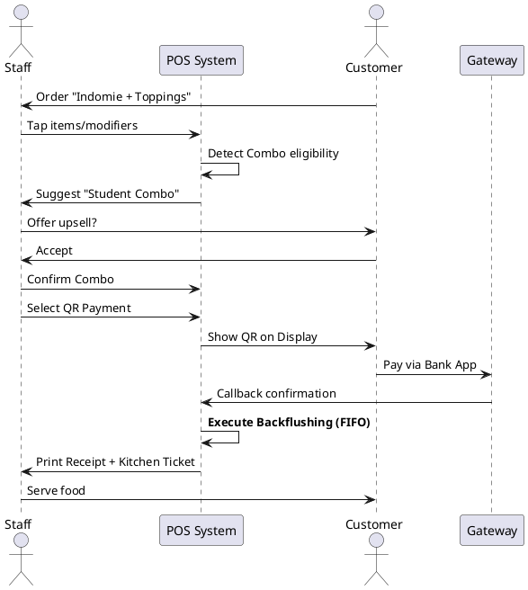

# Product Requirements Document - convenient-store (Compressed)

**Author:** Shaun | **Date:** 2026-01-23

---

## Executive Summary
**convenient-store** is a touch-optimized POS and inventory system for Vietnamese CVS. 
**Core Innovation:** **Invisible Backflushing** — automatic ingredient deduction (FIFO) for made-to-order items without manual staff tracking.

---

## MVP Success Criteria
- **Speed:** Transaction completion in **≤ 10 seconds**.
- **Accuracy:** < 2% inventory variance; 100% backflushing automation.
- **Traceability:** Every stock movement linked to `staff_id`, `timestamp`, and `reason_code`.
- **Explainability:** Drill-down from any inventory number to its contributing transactions.
- **Proactive:** Expiry alerts 30 min before deadline; auto-discounting for near-expiry items.

---

## Product Scope (MVP)
- **POS:** Touch cart, barcode scan, modifiers, combo auto-detection, Dual print (Receipt + Kitchen).
- **Payments:** Cash, QR Banking (External confirmation).
- **Inventory Engine:** Recipe explosion, State/Unit conversion, FIFO Batch tracking, Expiry timers.
- **Reporting:** End-of-day reconciliation, variance detection, transaction drill-down.
- **User Roles:** Staff (Sales, Waste, Refills) & Manager (Pricing, Recipes, Reports).

---

## User Journey: Happy Path

---

## Journey Requirements Summary
| Journey | Capabilities |
|---------|--------------|
| **1. Happy Sale** | Combo detection, QR confirmation, Backflushing |
| **2. Remake** | Waste logging, audit trail, remake policy |
| **3. Refill/Expiry** | Proactive alerts, FIFO batches, Expiry discount |
| **4. Reconciliation** | Variance detection, drill-down, cash count |
| **5. Manage Master** | Recipe builder, combo configuration |
| **6. Stock-In** | PO matching (Phase 2), quantity verification |

---

## Key Domain Rules
- **FIFO Enforcement:** Mandatory; no manual batch selection.
- **Physical/Sales SKU:** Separates inventory tracking (Physical) from revenue context (Full price vs Combo vs Discount).
- **No Direct Edit:** Orders are Voided + Recreated to maintain audit integrity.
- **Backflushing:** Triggered automatically upon payment confirmation.

---

## Functional Requirements (Core)
- **POS:** Modifiers, Combo upsell, Dual thermal print, daily order sequence.
- **Inventory:** Generic Recipe Engine, Unit conversion (1 pack -> N pieces), State conversion (Frozen -> Steamed).
- **Alerts:** Non-blocking toast alerts for expiry and refill thresholds.
- **Security:** PIN hashing, 2-min auto-lock, staff-tagged transactions.

---

## Non-Functional Requirements
| Metric | Target |
|--------|--------|
| **Transaction Time** | < 500ms |
| **App Load** | < 3s |
| **Print Latency** | < 2s |
| **Touch Target** | 44px (min) |
| **Uptime** | 99.5% |
| **Accuracy** | 100% calculation |
