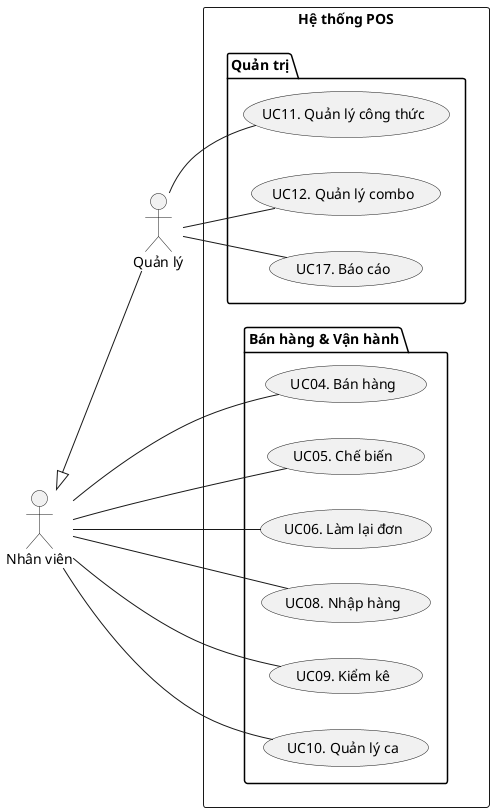

# Đặc Tả Use Case (Rút gọn)

**Dự án:** convenient-store | **Ngày:** 2026-01-25

---

## 1. Actors & Phân Quyền
- **Nhân viên:** Bán hàng, chế biến, nhập hàng, kiểm kê, quản lý ca.
- **Quản lý:** (Kế thừa Nhân viên) + Quản lý công thức/combo, cấu hình, báo cáo, nhân sự.
- **Khách hàng (External):** Xem màn hình, quét QR thanh toán (không tương tác trực tiếp POS).

---

## 2. Danh Sách Use Case
- **Xác thực:** Đăng nhập (PIN), Đăng xuất, Đổi PIN.
- **Bán hàng:** UC04 Bán hàng (gồm Tính tiền, Thanh toán, Xuất hóa đơn, Gợi ý combo).
- **Vận hành:** Chế biến (Backflushing), Làm lại đơn, Tiêu hủy (Waste), Nhập hàng, Kiểm kê, Quản lý ca.
- **Quản trị:** Quản lý Công thức, Combo, Danh mục, Khuyến mại, Nhân viên, Cấu hình, Báo cáo.
- **Nhân sự:** Chấm công, Xin nghỉ, Đăng ký lịch làm việc.

---

## 3. Quy Tắc Nghiệp Vụ (RB)
- **RB01-05 (Đơn hàng):** Không sửa đơn trực tiếp (Hủy + Tạo mới); Remake chỉ trong 10p lỗi NV; Không hoàn tiền.
- **RB06-10 (Tồn kho):** **FIFO bắt buộc**; Chặn bán hàng hết hạn; Mọi movement đều có log; Backflushing tự động.
- **RB11-14 (Người dùng):** Fast-switch PIN; Auto-lock idle; Staff attribution trên mọi giao dịch.
- **RB15-17 (Thanh toán):** Không split payment; MVP: Tiền mặt + QR Banking; Timeout 30s.

---

## 4. Sơ đồ Use Case

---

## 5. Thuật Ngữ Cốt Lõi
- **Backflushing:** Tự động trừ nguyên liệu theo công thức.
- **FIFO:** Hàng nhập trước xuất trước (First In First Out).
- **Physical/Sales SKU:** Tách biệt quản lý kho và ngữ cảnh bán hàng.
- **Waste:** Hàng hủy có lý do.
